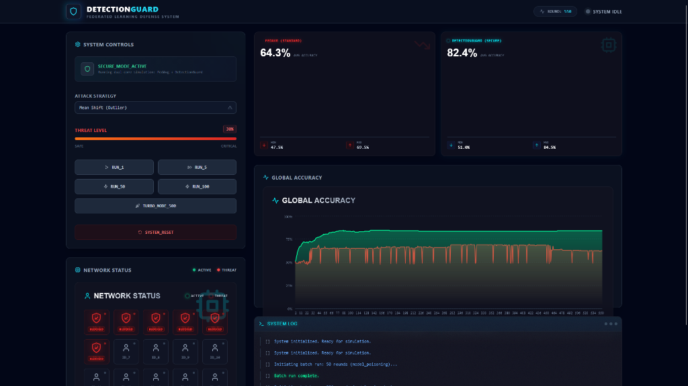

# DetectionGuard: Federated Learning Defense System

**DetectionGuard** is a robust simulation platform designed to demonstrate and analyze the impact of poisoning attacks on Federated Learning (FL) systems and the efficacy of defense mechanisms like **Trimmed Mean** aggregation.

## 🚀 Overview

Federated Learning allows multiple clients to collaboratively train a model without sharing their raw data. However, this decentralized approach is vulnerable to **Model Poisoning Attacks**, where malicious clients inject corrupted updates to compromise the global model.

**DetectionGuard** provides a visual, interactive environment to:
1.  **Simulate** a Federated Learning network with up to 20 clients.
2.  **Launch** targeted Mean Shift attacks from compromised nodes.
3.  **Compare** standard aggregation (FedAvg) vs. robust aggregation (Trimmed Mean) in real-time.
4.  **Visualize** the impact on Global Model Accuracy and individual client status.

## ✨ Key Features

*   **Dual Algorithm Simulation**: Run `FedAvg` and `DetectionGuard` (Trimmed Mean) simultaneously to see the divergence in performance under attack.
*   **Interactive Dashboard**: A "Cyberpunk" styled web interface built with **React** and **Tailwind CSS** to control the simulation.
*   **Real-time Visualization**:
    *   Dynamic Accuracy Charts (Recharts).
    *   Live Network Status Grid (Healthy vs. Attacking nodes).
    *   System Activity Logs.
*   **Configurable Attacks**: Adjust the percentage of malicious clients (0% to 50%) and observe the breaking point of standard algorithms.
*   **Robust Backend**: Powered by **Flask** and **PyTorch**, featuring a custom implementation of an MLP model and federated aggregation logic.
*   **Graceful Fallbacks**: The system automatically generates synthetic learnable data if external datasets (CICIDS2017) are missing.

## � Simulation Results


*Result after 550 rounds with 30% malicious attacks. The green line (DetectionGuard) maintains high accuracy while the red line (FedAvg) collapses.*

## �🛠️ Tech Stack

### Frontend
*   **Framework**: [React 18](https://react.dev/)
*   **Build Tool**: [Vite](https://vitejs.dev/)
*   **Styling**: [Tailwind CSS](https://tailwindcss.com/)
*   **Icons**: [Lucide React](https://lucide.dev/)
*   **Charts**: [Recharts](https://recharts.org/)

### Backend
*   **Server**: [Flask](https://flask.palletsprojects.com/)
*   **Machine Learning**: [PyTorch](https://pytorch.org/) & [Scikit-learn](https://scikit-learn.org/)
*   **Data Processing**: [Pandas](https://pandas.pydata.org/) & [NumPy](https://numpy.org/)

### DevOps
*   **Containerization**: [Docker](https://www.docker.com/) & Docker Compose

## � Dataset Setup (Required for Real Training)

The system is designed to work with the **CICIDS2017** dataset. While it will fall back to synthetic data if missing, for real results you must download the dataset.

1.  **Download** the cleaned dataset from Kaggle:
    [CICIDS2017 Cleaned and Preprocessed](https://www.kaggle.com/datasets/ericanacletoribeiro/cicids2017-cleaned-and-preprocessed)
2.  **Create** a `data` folder in the project root if it doesn't exist.
3.  **Place** the CSV file in the `data/` folder.
4.  **Rename** the file to `CICIDS2017_sample.csv` (or ensure it matches this name).

## �📦 Installation & Setup

### Option 1: Docker (Recommended)
The easiest way to run the project is using Docker Compose.

1.  **Prerequisites**: Install [Docker Desktop](https://www.docker.com/products/docker-desktop/).
2.  **Clone the repository**:
    ```bash
    git clone https://github.com/your-username/DetectionGuard.git
    cd DetectionGuard
    ```
3.  **Run the script** (Windows):
    Double-click `run_project.bat` checks availability and starts the containers.
    *OR*
    Run in terminal:
    ```bash
    docker-compose up --build
    ```
4.  **Access the App**:
    *   Frontend: [http://localhost:3000](http://localhost:3000)
    *   Backend API: [http://localhost:5000](http://localhost:5000)

### Option 2: Manual Setup

#### Backend
1.  Navigate to the backend directory:
    ```bash
    cd backend
    ```
2.  Create and activate a virtual environment:
    ```bash
    python -m venv venv
    venv\Scripts\activate # Windows
    # source venv/bin/activate # Mac/Linux
    ```
3.  Install dependencies:
    ```bash
    pip install torch flask flask-cors pandas numpy scikit-learn
    ```
4.  Run the server:
    ```bash
    python app.py
    ```

#### Frontend
1.  Navigate to the frontend directory:
    ```bash
    cd frontend
    ```
2.  Install dependencies:
    ```bash
    npm install
    ```
3.  Start the dev server:
    ```bash
    npm run dev
    ```

## 📂 Project Structure

```
DetectionGuard/
├── backend/                  # Flask + PyTorch Backend
│   ├── app.py                # API Entry point
│   ├── model.py              # MLP Neural Network definition
│   ├── aggregation.py        # FedAvg and Trimmed Mean logic
│   ├── data_loader.py        # Data ingestion (CICIDS2017 or Mock)
│   ├── verify_backend.py     # Unit tests for backend logic
│   └── Dockerfile            # Backend container instructions
├── frontend/                 # React Frontend
│   ├── src/
│   │   ├── components/       # UI Components (Controls, Charts, Grid)
│   │   ├── App.jsx           # Main Dashboard Logic
│   │   └── index.css         # Global Styles (Tailwind)
│   ├── vite.config.js        # Vite Configuration
│   └── Dockerfile            # Frontend container instructions
├── docker-compose.yml        # Service orchestration
├── run_project.bat           # Quick start script for Windows
└── README.md                 # Project Documentation
```

## 🧪 Verification

To verify that the backend logic (aggregation and model training) is working correctly, you can run the included test suite:

```bash
cd backend
python verify_backend.py
```
*Note: This script verifies the data loader, model forward pass, and aggregation math.*

## 🎮 Usage Guide

1.  **Open the Dashboard** at `http://localhost:3000`.
2.  **Configure Attack**: Use the slider in the "Control Panel" to set the **Malicious Client Ratio** (e.g., 20%).
3.  **Select Attack Type**: Currently defaults to "Model Poisoning" (Mean Shift).
4.  **Run Round**: Click **"Run Training Round"**.
    *   Watch the **Network Status** grid light up.
    *   Red nodes are Malicious, Green are Benign.
5.  **Observe Results**:
    *   The **Global Accuracy** chart will plot two lines:
        *   **Red Line**: Standard FedAvg (Accuracy will drop significantly as malicious % increases).
        *   **Green Line**: DetectionGuard (Accuracy remains stable).
6.  **Batch Run**: Use "Run 5 Rounds" for quick simulation of convergence.